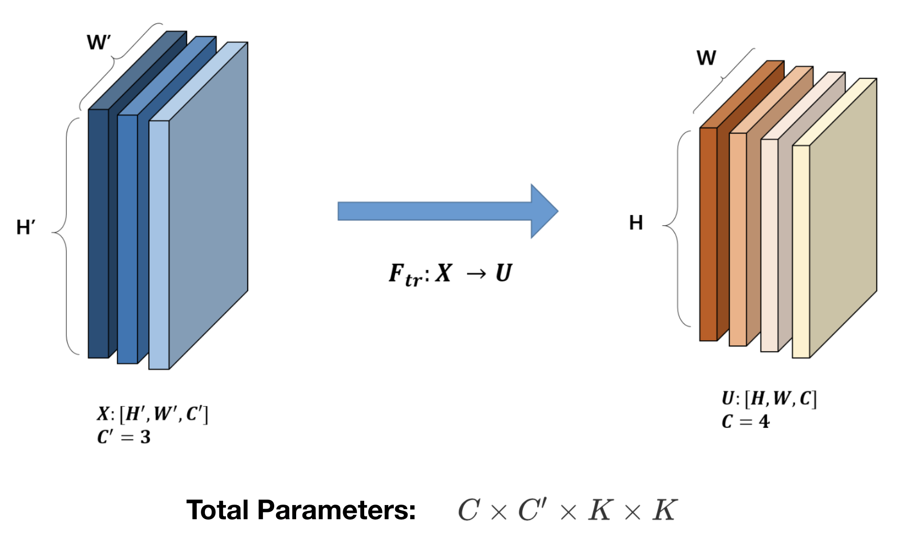
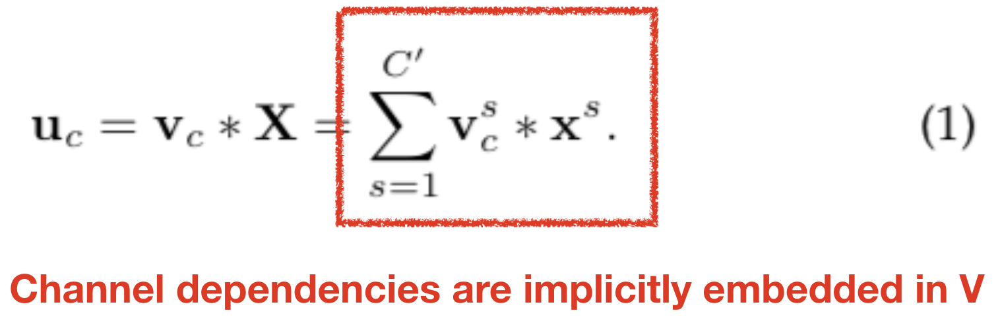
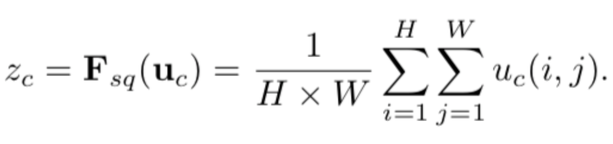
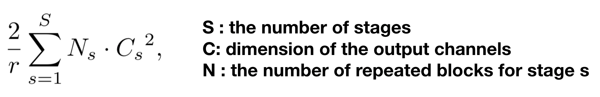
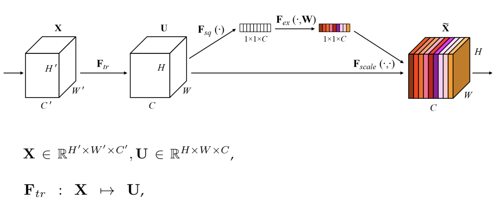
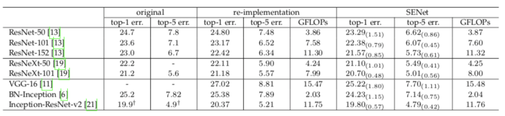

# Squeeze-and-Excitation Networks

Jie Hu, Li Shen, Samuel Albanie, Gang Sun, Enhua Wu

## Opinion

개인적으로, 아이디어에 굉장히 놀랐던 논문이다. NLP에서 사용되던 Attention Mechanism을 가져와 CNN에 응용하였고 이를 통해 엄청난 성능 향상을 이루었다. Domain Knowledge의 중요성을 한번 더 실감하게 된 논문이였다. 

## Contribution

논문 제목에서 알 수 있듯이 Squeeze, Excitation 두 개의 핵심적인 과정으로 구성된다. 이전 CNN의 구조를 보면 Channel의 Global Feature을 고려하지 못하고 있다는 한계점이 있었다. 이런 Global Feature를 고려하기 위하여 Squeeze 하고. 채널간의 중요도를 학습을 통하여 정해주기 위하여 Excitation 한다. 

아래 그림은 기존 CNN 에서의 연산을 나타낸다. 

아래 수식은 Convolution 연산을 나타내는데, V_c는 c번째 필터의 parameters를 나타낸다. 

아래의 빨간 사각형 부분을 보면, channel dependency가 implicitly embedded 됨을 확인할 수 있다. 

SENet 에서는 channel dependency를 explicit 하게 만드는 것을 목표로 한다. 

1. Squeeze
	* Global Information Embedding을 위한 과정이다. Channel Descriptor 를 만들어 Global Spatial Information을 표현한다. 
	* Channel Descriptor Function 은 다양하게 선택할 수 있다. 논문에서는 Global Average Pooling(GAP)를 사용하였는데, 실험 결과가 좋았고 parameter의 추가적인 증가가 없어서 좋다고 설명한다. 

2. Excitation
	* Excitation 이 수행되기 위해서는 2가지의 전제조건이 필요하다. 
	* It must be flexible : 채널들 간의 비선형적인 관계를 학습할 수 있어야 한다. 
	* It must learn non-mutually-exclusive relationship : 다양한 채널을 동시에 강조할 수 있어야 한다. 만약 여러개의 채널이 같이 중요하다면 그 중 하나를 선택하는 것이 아닌 여러개의 채널을 모두 중요하게 여겨야 한다. 

아래 그림은 Squeeze & Excitation 의 수식이다. 아래 식에서 r은 reduction ratio를 나타내는데, fully connected에서 parameter가 크게 증가되기 때문에 reduction ratio를 통해 이를 줄여준다.

3. Like A Block
	* 위의 Squeeze & Excitation을 하나의 Block으로 구성하여 다양한 부분에 Flexible 하게 끼워넣을 수 있다. 
	* 아래 그림은 Inception, ResNet에 적용한 그림이다. SEBlock 이라는 개념으로 사용한다. 

4. Low Parameter (relatively)
	* SEResNet의 경우 10% 정도의 파라미터가 증가하게 되지만, 마지막 부분의 SEBlock을 제거함으로써 파라미터의 증가를 4% 정도까지 낮출 수 있다고 설명한다. 그리고 이는 정확도에서는 거의 차이가 없다고 설명한다. 
	* 즉, 4%의 파라미터 증가로 정확도를 향상시켰다고 설명한다. 

## Architecture

Architecture를 보면 Channel이 색상별로 다른 것을 확인할 수 있는데, 이것이 Channel간의 가중치를 나타낸다. 

## Experiments & Results

아래 표는 SENet의 성능 비교를 나타낸다. 파라미터는 비슷하게 유지하면서 정확도가 좋아진 것을 확인할 수 있다. 

아래 표는 Reduction Ratio의 실험 표이다. 실험 결과 r=16 으로 설정하였다.

아래 표는 Squeeze 에서 avg pooling을 사용한 이유를 설명한다. 실험적으로 avg pooling이 성능이 좋았다고 한다. 

아래 표는 Excitation 에서 sigmoid를 사용한 이유를 설명한다. 이 역시 실험적으로 sigmoid가 좋아서 사용했다고 한다. 

