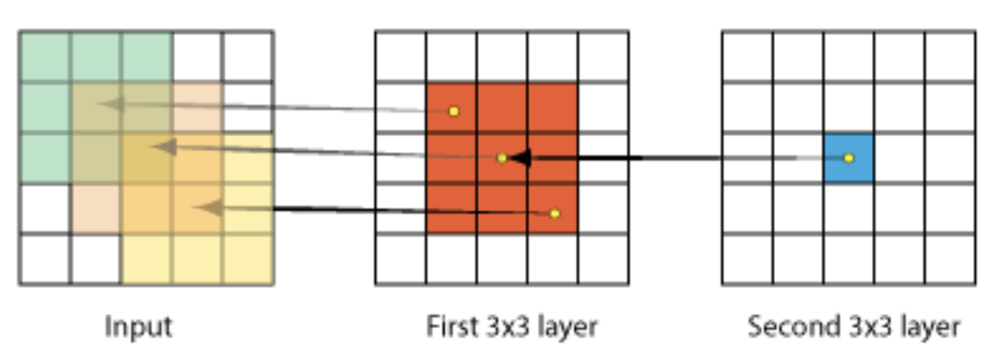
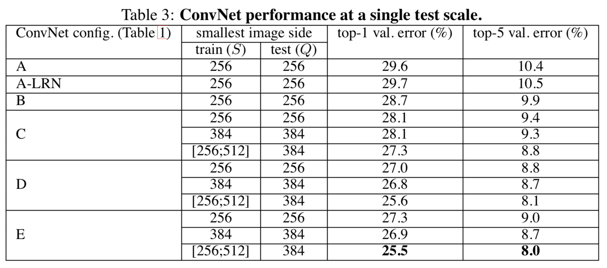

# Very Deep Convolutional Networks For Large-Scale Image Recognition

Karen Simonyan, Andrew Zisserman

## Opinion
AlexNet은 최초로 SVM 기반의 classifier를 이겼다는 점에서 시사하는 바가 컸고, Drop Out, ReLU 2가지의 핵심적인 기법을 소개했는데, VGGNet 이후로는 점점 더 deep network architecture를 만드는 데 초점을 두고 연구가 진행된다. 

*Main Focus : Deep Network! Less Parameters !*

## Contribution

Deep Nerual Network를 설계하는데에 있어, Kernel Size의 중요성을 설명해주는 좋은 Architecture 이다.

AlexNet에서 사용되었던 Convolution Filter 의 사이즈를 3x3으로 줄여 연산량을 크게 줄였다. 

VGG Network 에서 중요한 한 가지를 꼽으라 하면 바로 Filter의 사이즈 일 것이다.

1. Kernel Magic
	* 개인적으로 아이디어에 감동을 받아, Kernel Magic으로 이름 지었다.
	* 같은 receptive field를 가지면서 parameter를 줄이기 위한 방법이다. 아래 그림은 5x5 convolution filter와 3x3 convolution filter 2개를 serial하게 놓은 것이 같은 receptive field를 가진다는 것을 보여준다. 
	* 어떻게 보면 VGG Network에서는 이 Kernel Magic 외에는 시사하는 점이 크지 않은 것 같다. 

	* 3x3 convolution filter 2개로 5x5 convolution filter를 만들 수 있고, 3x3 convolution filter 3개로 7x7 convolution filter를 만들 수 있다. 
	* 아래 그림은  parameter의 수를 비교하는 그림이다. 

2. Local Response Normalization(LRN)
	* AlexNet에서 사용된 LRN이 성능 향상에 별로 의미가 없고 메모리 소비, 계산시간의 증가를 초래한다고  주장한다. 

## Architecture

VGG Network에서 자주 사용되는 구조는 VGG-16, VGG-19이다. 

## Experiments & Results

실험에서 사용한 5가지의 구조이다.C의 구조를 보면 1x1 convolution filter를 사용한 것을 볼 수 있다. 1x1 convolution filter를 사용하여 receptive field에 영향을 미치지 않으면서, non-linearity를 증가 시켰다는 점에서 의의를 가진다. 

이 network 이후에는 이 1x1 filter 사용하여 다른 기능을 수행하지만, 여기서는 다루지 않기로 한다. 

A, A_LRN을 비교해보면 LRN의 효과가 미미하다는 것을 알 수 있다. 

train set, test set 의 사이즈를 다양하게 하여 테스트 한 결과이다. 

