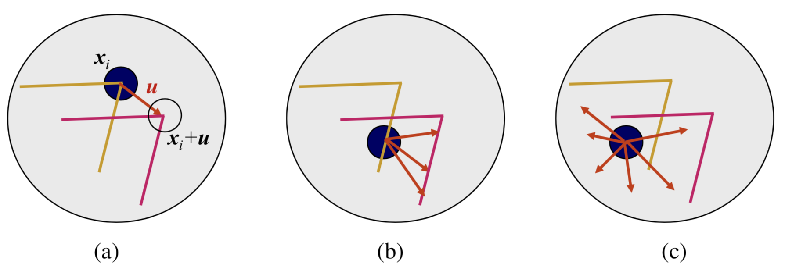
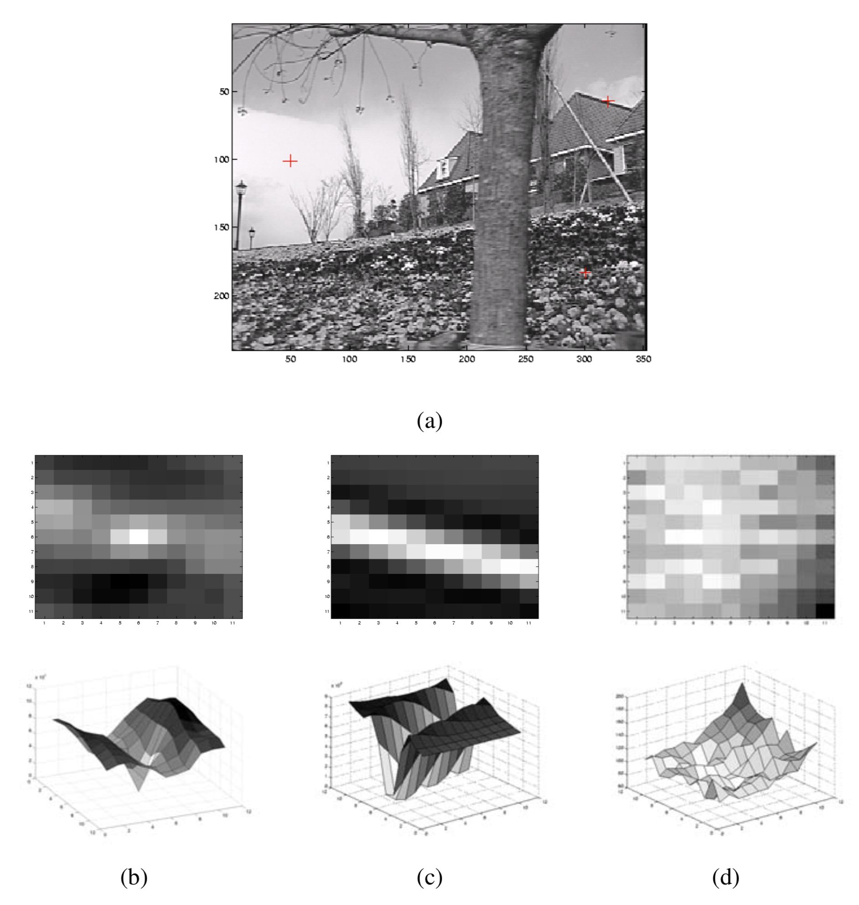

# Feature detection and matching

* Feature Detection and matching are an essential component of many computer vision applications.

  

## Points and patches

* Where to use ?
  * Computing camera pose
  * Stereo matching
  * Video stabilization
  * Object instance and category recognition

## Feature detectors

* What is good feautre ?
  * Textureless patches are nearly impossible to localize.

  * Patches with large contrast changes (gradients) are easier to localize, although straight line segments at a single orientation suffer from the <u>aperture problem</u>.

  * Aperture problems for different image patches.

    

    

  * Patches with gradients in at least two (significantly) different orientations are the easiest to localize.
    $$
    E_{ WSSD }(u)=\sum _{ i }^{  }{ {w(x_i)[I_1(x_i+u) - I_0(x_i)]}^2 }
    $$

  * When performing feature detection, we do not know which other image locations the feature will end up being matched against. Therefor, we can only compute how stable this metric is with respect to small variations in position $$\triangle u$$ by comparing an image patch against itself, which is known as an <u>auto-correlation function or surface</u>
    
    $$
    E_{ AC }(\triangle u)=\sum _{ i }^{  }{ {w(x_i)[I_0(x_i+u) - I_0(x_i)]}^2 }
    $$
    

  * Three auto-correlation surfaces $$E_{AC}(\triangle u)$$ shown as both grayscale images and surface plots:

    