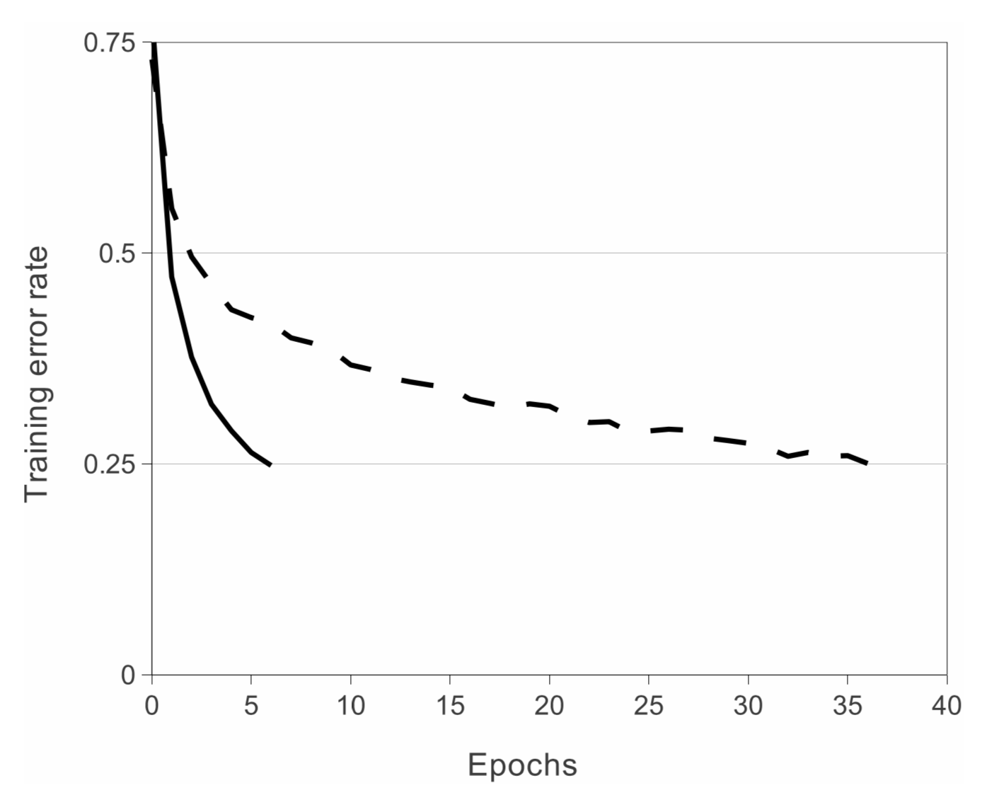

# AlexNet 

Alex Krizhevsky, Geoffrey E. Hinton

## Contribution

AlexNet은 ILSVRC Competition에서 SVM을 제치고 우승을하는 성과를 보였다. 
이전까지는 SVM이 우수한 성능을 보였기 때문에 CNN의 연구가 활발하게 이루어지지 않았는데, AlexNet을 계기로 CNN연구가 활발하게 진행되었다. 

AlexNet에서 시사하는 포인트를 크게 3가지로 나누어보면

1. ReLU Function
2. Local Response Normalization
3. Drop Out

이 3가지로 나누어 볼 수 있다.

1. ReLU Function
	* Activation Function에서 기존에 사용되던 tanh가 아닌 ReLU를 사용하였다. 이를 통하여 gradient vanishing 문제를 완하시키고, Cost Function의 수렴속도를 증가시켰다. 

2. Local Response Normalization
	* Normalization Layer를 추가하여 성능을 향상시켰다고 논문에 언급되어 있지만, 후속작인 VGG Network에서 이를 반증한다. 계산량만 늘어날뿐 실제 효과가 없음을 실험을 통해 확인한다. 

3. Drop Out
	* 아직까지도 많은 네트워크에서 사용하는 기법이다. Drop Out을 사용하여 Network Training시에 Overfitting을 방지한다. 당연하게도, Test 과정 (Inference)에서는 사용하지 않는다.

  

## Architecture

AlexNet의 Architecture는 다음과 같다. 

AlexNet은 Network가 2갈래로 나뉘어 구성되어 있는 것을 확인할 수 있는데, 이 당시 GPU가 GTX580 이여서 메모리의 문제를 해결하기 위하여 이런 구조를 취했다고 한다. 

3번째 7번째 Layer에서는 서로의 정보를 교환하는 형태로 구성하였다. 

ILSVRC 2010 Datasets에서의 실험 결과이다. 그동안 절대적으로 여겨졌던 SVM을 이겼다는 점에서 시사하는 바가 있다.  
   

ILSVRC 2012 Datasets에서의 실험 결과.  

