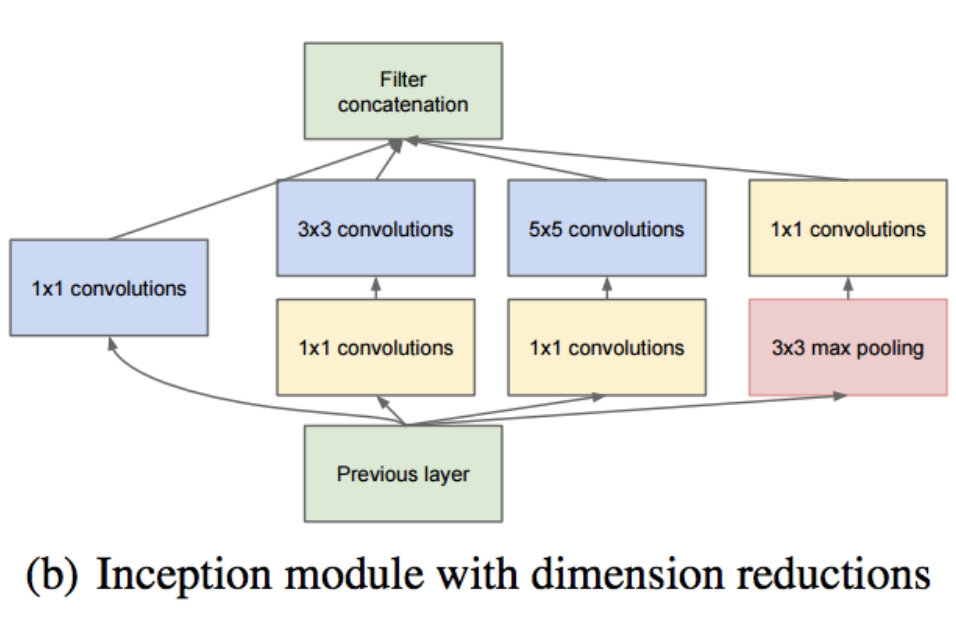
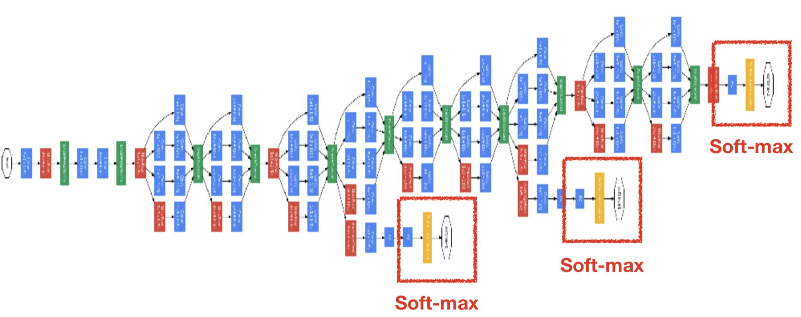

# GoogLeNet

Christian Szegedy, Wei Liu, Yangqing Jia, Pierre Sermanet, Scott Reed, Dragomir Anguelov, Dumitru Erhan, Vincent Vanhoucke, Andrew Rabinovich

## Contiribution

ILSVRC 14의 Classification, Detection 에서 1등을 차지한 GoogLeNet에 관한 Paper 이다. 

1. Inception Module
	* 딥러닝 네트워크의 효율적인 설계를 위해서는 sparse한 Layer와 dense한 matrix를 만들어야 하는데, 이 두가지는 trade-off 관계이다. 
	* 이런 trade-off 문제를 해결하기 위하여 Inception Module 이라는 개념을 도입했다. 
	* 아래 그림 1-1은 Naive Inception Module 을 나타낸다. 다양한 크기의 convolution filter를 통과시키고 이를 concatenation 함으로써 spare layer + dense matrix의 trade-off 문제를 해결하였다. 
	* 여기서 의문점이 하나 생기는데, 5x5 convolution filter의 존재이다. VGG Network에서 보였듯이 convolution filter 의 크기가 커지면 training parameter가 커지게 된다. 그래서 GoogLeNet에서는 1x1 convolution filter를 사용한다. 
	* 아래 그림 1-2는 1x1 convolution filter를 사용한 Inception Module의 구조이다. 여기서 1x1 convolution filter의 엄청난 사용성을 알 수 있다. input size에 상관없이 depth를 줄일 수 있다.

[그림 1-1. Naive Inception Module]

[그림 1-2. Inception Module with Dimension Reduction]

2. Network In Network(NIN)
	* 이전 네트워크들에서 사용하던 Fully-Connectied Layer(FC Layer)의 단점을 언급한다. 사실상 대부분의 CNN 네트워크에서 제일 많은 Parameter를 차지하는 부분이 바로 FC Layer이다. 
	* GoogleNet에서는 이런 문제점을 해결하기 위하여 기존 CNN 네트워크와 다르게 NIN 구조를 사용하였고, FC Layer 대신에 Global Average Pooling(GAP)을 활용하였다. 

## Architecture

굉장히 복잡해 보이는 GoogLeNet의 Architecture 이다. 빨간색 사각형으로 표시해 놓은 부분들이 Inception Module 이다. 

Architecture 그림을 보면 알 수 있는 점이 하나 있는데, 상위 layer에서는 Inception Module을 사용하지 않는다는 점이다. 논문에서는 이러한 상위 레이어를 Stem 이라고 이름지었다.   

Stem, Inception Module 외에도 한 가지 특이한 점이 있다. 바로 Auxillary Soft-max 이다. Gradient Vanishing 문제를 해결하기 위하여 이러한 구조를 취했다고 한다. 아래 그림은 Auxillary Soft-max를 나타낸다. 

Auxillary Soft-max 의 구조에서 알 수 있듯이, 구글에서는 GoogLeNet이 오류 역전파가 잘 이루어 지지 않는다는 것을 알고있었던 것 같다. 

실제로, 2014 ILSVRC에서 1위는 GoogLeNet이 차지했지만 사람들이 더 많이 사용한 Network Architecture는 VGG 였다. 오류 역전파가 잘 이루어 지지 않는다는 점 외에도, 구현하기에 어렵다는 문제도 존재하였다. 

## Experiments & Results

표에서의 7 model은 앙상블 모델을 나타낸다. 

