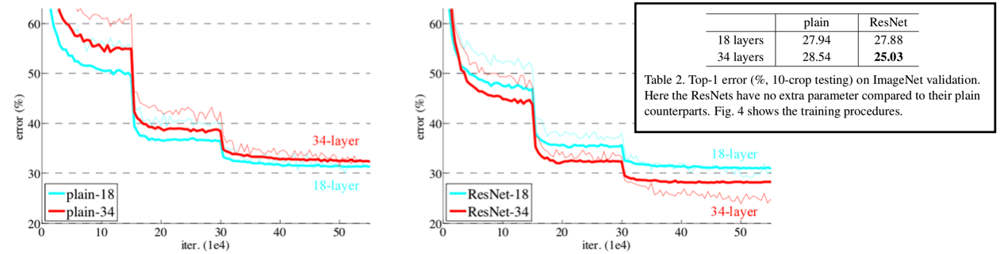
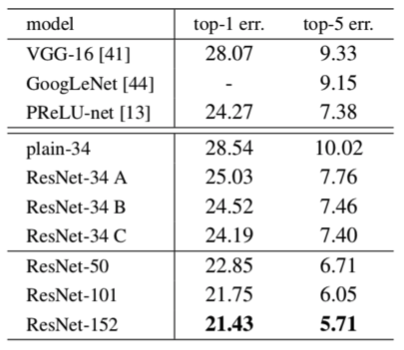
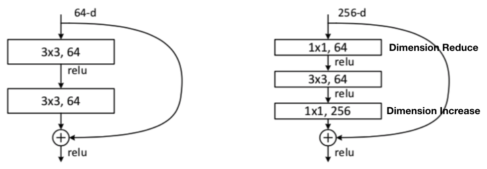

# Deep Residual Learning for Image Recognition

Kaiming He, Xiangyu Zhang, Shaoqing Ren, Jian Sun

## Opinion
딥러닝의 성능 향상을 위하여 계속적으로 이루어진 노력들이 바로 Deep Network 이다. 
그렇지만, 이런 Deep Network 에서의 문제점을 ResNet에서 연구하게 되었고 Residual Network라는 기법을 남기게 된다. 

Residual Network는 현재까지도 많은 네트워크에서 사용하는 구조이다. 

## Contribution

ResNet의 기여를 크게 두 가지로 나누어보려고 한다. 첫 번째는 Deep Neural Network 를 구성하는데 있어서 단순히 깊이를 깊게한다고 성능이 좋아지지 않는다 라는 것을 밝혀낸 점. 두 번째는 Residual Network(Shor-cut Connection) 구조이다. 

1. Is Deep Neural Network best?
	* 네트워크의 깊이가 깊어진다고 무조건 좋냐? 라는데에 있어서 반례를 제공한다. 
	* 이러한 현상의 원인이 Gradient Vanishing/Exploding 문제가 아니라고 설명한다.
	* 네트워크의 깊이가 깊어지면서 Input Image가 갖고 있는 정보가 하위 Layer로 가면 갈수록 소실되게 되는데, 이러한 문제 때문에 깊이가 깊어지는게 최선은 아니라고 설명한다.
	* 아래 그림은 56-layer와 20-layer의 error 비교 표이다.

2. Residual Network
	* 아래 그림 2-1에서 왼쪽은 일반적인 CNN의 구조이고, 오른쪽은 ResNet에서 제안하는 Residual Network의 구조이다. 
	* input X 를 그대로 element-wise add 하는 구조를 볼 수 있는데, 이를 통해 input의 정보를 손실하는 것을 막을 수 있다고 한다. 또한, element-wise add 연산 이기 때문에 training parameter가 증가하지 않는다는 장점도 있다. 
	* 아래 그림 2-2 에서의 수식을 보면 W_s를 볼 수 있는데, 이는 matrix의 add연산에서 dimension을 맞춰주기 위한 parameter이다. 하늘색 사각형으로 표시한 부분이 Short-cut connection 부분이다. 

[그림 2-1]

[그림 2-2]

## Architecture

34-layer plain ResNet과 34-layer residual ResNet의 Architecture 이다. 34-layer residual ResNet의 Architecture를 자세히 보면 점선으로 그려진 선과 실선으로 그려진 선을 확인할 수 있는데, 점선으로 그려진 선이 Shor-cut 부분이다. 좀 더 자세히 살펴보면 Shor-cut connection 부분에서만 stride를 2로 주는 것을 확인할 수 있다.

## Experiments & Results

아래 그림은 ResNet-18과 ResNet-34를 비교한 그림이다. 

VGG, GoogLeNet 과의 비교 실험.

## BottleNeck Layer

위에서 ResNet의 두가지 중요점을 언급했는데, 사실 한가지 더 중요점이 있다. 바로 BottleNeck Layer 이다. 앞에서 1x1 conv layer의 다양한 활용성에 대하여 언급한 적이 있는데, 바로 여기서 그 활용점이 나타난다. GoogLeNet 에서도 dimension reduction에 1x1 conv layer를 활용한 사례가 있다. 

아래 그림은 BottleNeck Layer의 구조를 나타낸다. 왼쪽의 그림이 기본 Residual Network의 구조이고, 오른쪽 그림이 Residual Network에 BottleNeck Layer의 구조를 더한 구조이다. 
1x1 conv filter를 통하여 dimension reduction을 하고, 3x3 conv filter를 통과시킨 후 다시 1x1 conv filter를 통해 dimension increment 하는 구조이다. 마치 병목 현상과 비슷하여 BottleNeck Layer라고 불리운다. 

