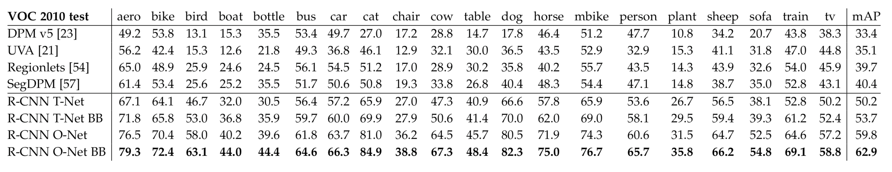
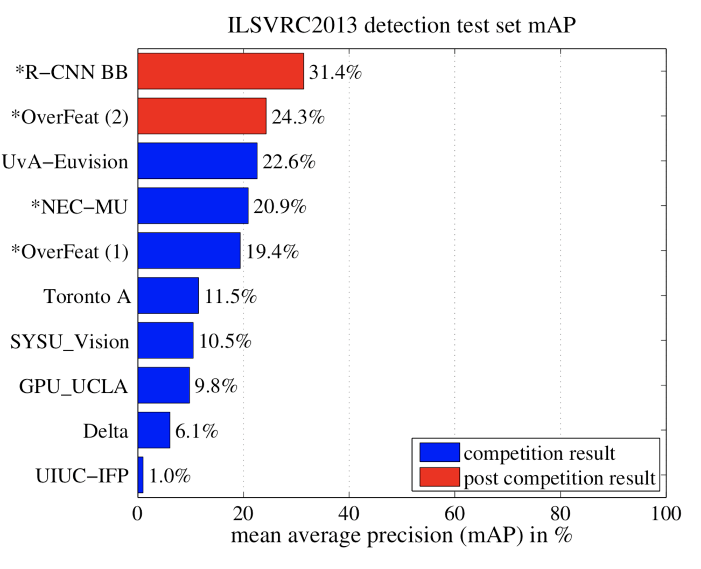

# Region-based Convolutional Networks for Accurate Object Detection and Segmentation (R-CNN)

Ross Girshick, Jeff Donahue, Student Member, IEEE, Trevor Darrell, Member, IEEE, and Jitendra Malik, Fellow, IEEE

## abstract

* 2가지의 메인 아이디어를 혼합했다. 
	1. 	Object의 위치를 파악하고 분리하기 위하여 Bottom-up 방식의 region proposal 을 적용했다.
	2. 	트레이닝 데이터가 부족할 때의 문제를 해결하기 위하여 pre-training 기법을 사용했다.
* Detection을 regression 문제로 보고 해결하려고 하였지만, multi-object에서 문제가 발생했다.
	(single object에서는 꽤나 잘 동작함. )
* 다른 대안으로 sliding-window detector를 사용하려 하였으나, 이 방법은 모든 물체가 동일한 aspect ratio를 가져야 한다는 문제점이 있다.
* "recognition using regions" paradigm을 사용하여 localization problem을 해결하였다. 
* Large Scale 데이터로 pre-training을 한 후에, speific한 도메인 데이터를 fine-tuning 하는 것이 트레이닝을 할 때 효과적이라는 것을 보였다.

* 위의 그림은 전체 R-CNN의 흐름을 나타낸다. 

## OBJECT DETECTION WITH AN R-CNN

R-CNN은 3개의 모듈로 구성된다.
1. Category independent region proposal module
2. Convolutional network that extracts a fixed-length feature vector from each region
3. Class-specific linear SVMs

### Module Design

**Region Proposals**

objectness, selective search, category-independent object proposals, constrained parametric min-cuts(CPMC)등의 다양한 기법이 있지만 R-CNN에서는 selective search 사용함.

**Feature Extraction**

CNN을 사용하여 각 영역에서 fixed-length feature vector 를 추출하였다. 
CNN의 입력으로 넣어주기 위해서는 이미지의 사이즈가 고정되어야 하는데, R-CNN 에서는 단순한 방법인 Warping을 사용하였다. 

### Test-time detection

테스트에서의 흐름은 다음과 같다. 
2,000개의 영역을 제안하고, 이를 CNN에 입력으로 넣어 feature vector를 추출한다. 추출된 feature vecor 는 SVM을 활용하여 class 간의 점수를 설정한다. 이후에는 greedy non-maximum sppression을사용한다. 

**Run-time analysis**
1. 모든 CNN의 파라미터는 모든 카테고리에 대하여 parameter를 공유한다. 
2. 다른 방법(spatial pyramids with BoW encodings)와 비교했을 떄, 차원이 낮다. 

**Domain-specific fine-tuning**
1. ImageNet을 통하여 학습을 시킨 이후에, warped region proposal에 대하여 SGD training을 진행하였다. 
2. ImageNet의 1000개의 클래스에 1개의 클래스를 추가하여 배경으로 설정하였다. 
3. Ground-Truth box 와의 IoU가 0.5 이상인 경우에 Positive, 그 외의 경우에는 Negative로 설정하였다. 
4. 초기 SGD의 learning rate는 0.001로 설정하였으며, iteration마다 32개의 positive window와 96개의 background window로 구성된 128개의 mini-batch를 구성하였다. sampling에 bias를 둔 이유는 실제 상황에서 배경이 잡힐 확률이 더 많기 때문이다. 

**Object category classifiers**
1. IoU threshold 를 사용하여, 참/거짓 기준의 명백함을 세웠다. 
(차를 인식한다고 했을 때, 어느정도 겹쳐야지 차라고 인식할지에 대한 판단의 기준이 필요하다.)
2. overlap threshold는 0.3으로 설정하였는데, 이는 validation set에서의 grid search를 통하여 설정하였다. 
3. 하나의 SVM classifier를 활용하여 큰 데이터를 분류하는 것은 메모리의 소모가 크기 때문에 hard negative mining method를 활용하였다. 

## ANALYSIS

**[Detection average precision (%) on VOC 2010 test]**

**[ILSVRC2013 detection test set mAP]**

**[Visualization TorontoNet pool5]**

### Ablation Studies
**no fine-tuning**
layer의 특성을 파악하기 위하여, 끝의 layer 들을 제거해보면서 성능을 테스트 해보았다. 그 결과 fc7, fc6을 제거하고 fc5에서 feature map을 추출한 것의 성능이 제일 좋았다. 
(파라미터의 수는 제일 적었지만 성능이 좋다는 것에 의미를 둔다. 또한, CNN의 representational power가 convolutional layer에서 나온다고 설명한다.)

**fine-tuning (ImageNet)**
ImageNet으로 pre-training 한 후의 결과는 놀라웠다. 무려 mAP 8%가 증가하였고 fc5 보다 fc6, fc7 이 훨씬 더 영향을 미쳤다. ImageNet으로 pre-training 한 fc5 가 일반적인 특징점들을 잘 나타내고, fc6과 fc7이 도메인에 특화된 classifier를 얻는다는 것을 확인했다. 

