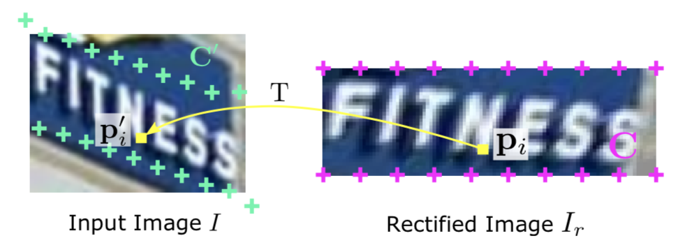
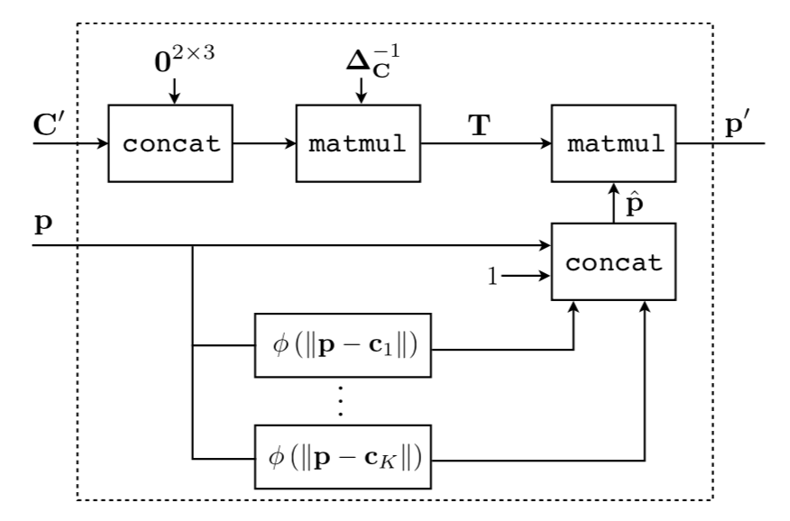

#ASTER: An Attentional Scene Text Recognizer with Flexible Rectification

Baoguang Shi, Mingkun Yang, Xinggang Wang, Pengyuan Lyu, Cong Yao, Xiang Bai

## INTRODUCTION

* Previous methods do not explicitly address the problem of irregular text.

* The model comprises two parts: the rectification network and the recognition network.

  

  

* Given an input image, the rectification network transforms the image to rectify the text in it.

  * The transformation is parameterized Thin-Plate Spline(TPS).

    

* During inference,

  * The rectification network first predicts the <u>TPS parameters</u> from the image.
  * Based on <u>STN, rectification network ca be trained</u> purely by the gradients back propagated by the recognition network, hence requiring no human annotations.
  * <u>The recognition network</u> predicts a charater sequence from the rectified image in an <u>attentional sequence to sequence manner.</u>

* In particular, ASTER enables a horizontal text detector to detect oriented text.

* Contributions

  * Tackle the problem of irregular text recognition with an explicit rectification mechanism, which significantly <u>improves recognition performance without extra annotations.</u>
  * Introduce attentional sequence-to-sequence model.
  * Propose a method for enhancing text detectors.

## MODEL

### Rectification Network

* Adpot Thin-Plate-Spline(TPS) as the transformation.
  * It is more flexible compared to other simpler 2D transformations.
  * <u>TPS performs non-rigid deformation on images, handling a variety of distortions.</u>

* **Localization Network**
  * A TPS transformation is determined by two sets of control points of equal size, denoted by $$K$$.

  * When the <u>control points on the input image are predicted</u> along the upper and lower text deges, the resulting <u>TPS transformation outputs a rectified image with regular text.</u>

    

  * The prediction is performed by convolutional neural network.
    
    $$
    C = [c_1,...,c_k] \in R^{2 \times K}
    $$

    $$
    C_k = [x_k,y_k]^T
    $$

    $$
    C' = [c'_1,...,c'_k]
    $$

    

    * The network consists of a few convolutional layers, with max-pooling layers inserted between them. 
    * The output layer is a fully-connected layer whose output size is $$2K$$. Its output vector is reshaped to $$ C \in R^{2 \times K}$$. 
    * $$C'$$ and $$C$$ are normalized image coordinates, where $$(0,0)$$ is top left corner and $$(1,1)$$ the bottom right.
      

  * All modules in the rectification network are differentiable.

  * Localization network <u>is trained purely</u> by the back-propagated gradients, <u>requiring no manual annotations</u> on the control points.
    

* **Grid Generator**

  

  

  * The grid generator computes a transformation and applies it to every pixel locations in $$I_r$$, generating a sampling grid $$ P = [p_i]$$ on $$I$$. 
    

* **Sampler**

  * The sampler generates the rectified image:
    $$
    I_r = V(P,I)
    $$

  * It can back propagate the gradients on $$I_r$$ to $$P$$. This is achieved by the differentiable image sampling method.

* **Comparison with STN and RARE**

  * Use images of different sizes for the localization network and for the sampler.
    * The localization network operates on the smaller image, $$I_d$$, which is a downsampled version of $$I$$, in order to <u>reduce the number of parameters</u> needed for the prediction.
    * Meanwhile, the sampler operates on the original image. sampling on a high-resolution image avoids degraded output resolution.

### Recognition Network

* CTC does not have mechanism to model the dependencies among its output characters.

